# Grad-CAM.pytorch

​          pytorch 实现[Grad-CAM:Visual Explanations from Deep Networks via Gradient-based Localization](https://arxiv.org/pdf/1610.02391) 和

[Grad-CAM++: Improved Visual Explanations for Deep Convolutional Networks](https://arxiv.org/pdf/1710.11063.pdf)

1. [依赖](#依赖)
2. [使用方法](#使用方法)
3. [样例分析](#样例分析)<br>
   3.1 [单个对象](#单个对象)<br>
   3.3 [多个对象](#多个对象)<br>
4. [总结](#总结)
5. [目标检测-faster-r-cnn](#目标检测-faster-r-cnn)<br>
   5.1 [detectron2安装](#detectron2安装)<br>
   5.2 [测试](#测试)<br>
   5.3 [Grad-CAM结果](#Grad-CAM结果)<br>
   5.4 [总结](#总结)
6. [目标检测-retinanet](#目标检测-retinanet)<br>
   6.1 [detectron2安装](#detectron2安装)<br>
   6.2 [测试](#测试)<br>
   6.3 [Grad-CAM结果](#Grad-CAM结果)<br>
   6.4 [总结](#总结)
7. [目标检测-fcos](#目标检测-fcos)<br>
   7.1 [AdelaiDet安装](#AdelaiDet安装)<br>
   7.2 [测试](#测试)<br>
   7.3 [Grad-CAM结果](#Grad-CAM结果)<br>
   7.4 [总结](#总结)

**Grad-CAM整体架构**

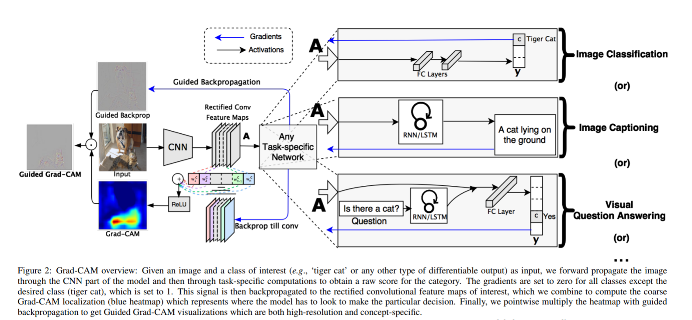


**Grad-CAM++与Grad-CAM的异同**


## 依赖

```wiki
python 3.6.x
pytoch 1.0.1+
torchvision 0.2.2
opencv-python
matplotlib
scikit-image
numpy
```


## 使用方法

```shell
python main.py --image-path examples/pic1.jpg \
               --network densenet121 \
               --weight-path /opt/pretrained_model/densenet121-a639ec97.pth
```

**参数说明**：

- image-path：需要可视化的图像路径(可选,默认`./examples/pic1.jpg`)

- network: 网络名称(可选,默认`resnet50`)
- weight-path: 网络对应的与训练参数权重路径(可选,默认从pytorch官网下载对应的预训练权重)
- layer-name: Grad-CAM使用的层名(可选,默认最后一个卷积层)
- class-id：Grad-CAM和Guided Back Propagation反向传播使用的类别id（可选,默认网络预测的类别)
- output-dir：可视化结果图像保存目录(可选，默认`results`目录)


## 样例分析

### 单个对象

**原始图像**


**效果**

| network      | HeatMap                                   | Grad-CAM                              | HeatMap++                                   | Grad-CAM++                              | Guided backpropagation               | Guided Grad-CAM                          |
| ------------ | ----------------------------------------- | ------------------------------------- | ------------------------------------------- | --------------------------------------- | ------------------------------------ | ---------------------------------------- |
| vgg16        | 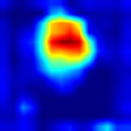       | 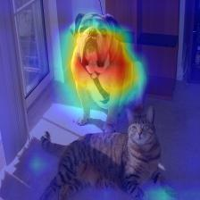       | 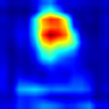       | 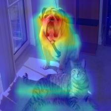       | 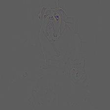       | 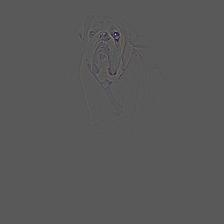       |
| vgg19        | 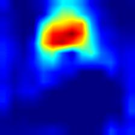       | 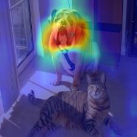       | 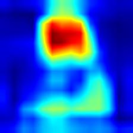       | 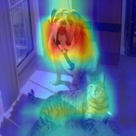       | 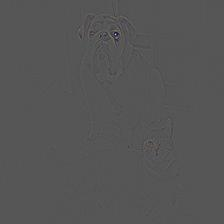       | 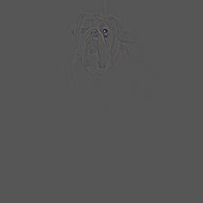       |
| resnet50     | 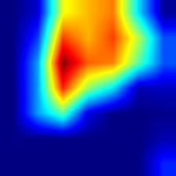    | 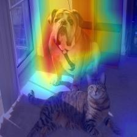    | 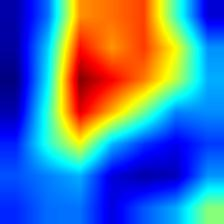    | 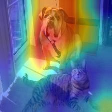    | 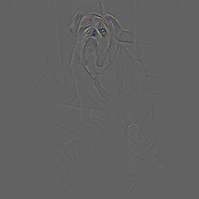    | 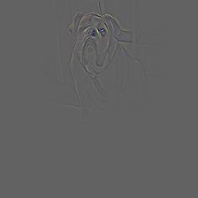    |
| resnet101    | 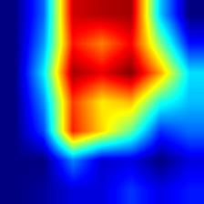   | 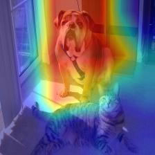   | 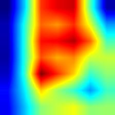   |     | 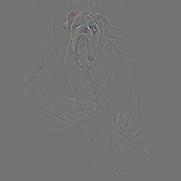   | 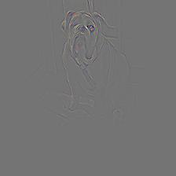   |
| densenet121  | 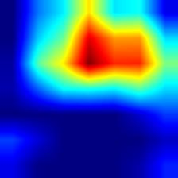 | 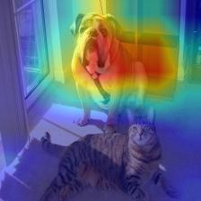 | 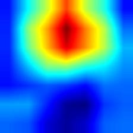 | 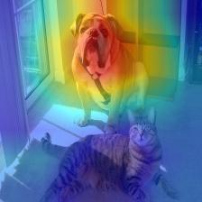 | 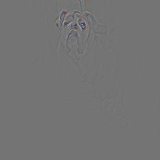 | 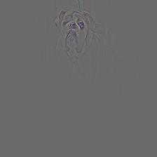 |
| inception_v3 | 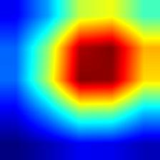   | 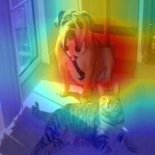   | 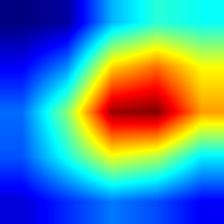   | 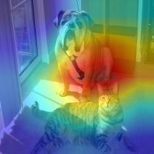   | 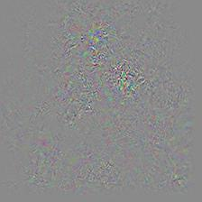   | 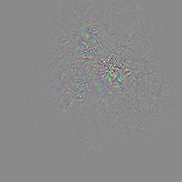   |
| mobilenet_v2 | 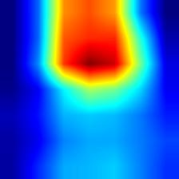   | 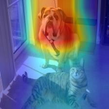   | 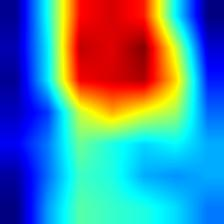   | 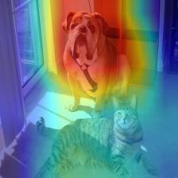   | 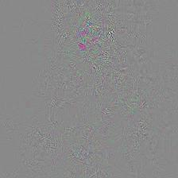   | 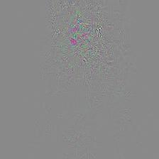   |
| shufflenet_v2 | 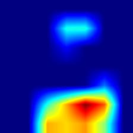   | 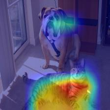   |    | 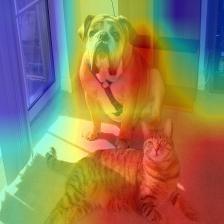   | 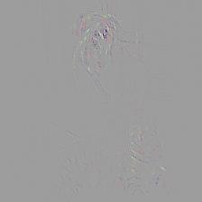   | 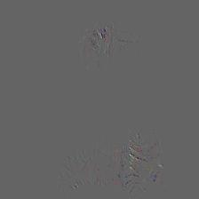   |

### 多个对象

​         对应多个图像Grad-CAM++比Grad-CAM覆盖要更全面一些，这也是Grad-CAM++最主要的优势

**原始图像**

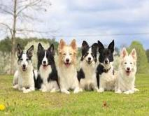

**效果**

| network      | HeatMap                                   | Grad-CAM                              | HeatMap++                                   | Grad-CAM++                              | Guided backpropagation               | Guided Grad-CAM                          |
| ------------ | ----------------------------------------- | ------------------------------------- | ------------------------------------------- | --------------------------------------- | ------------------------------------ | ---------------------------------------- |
| vgg16        | 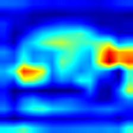       | 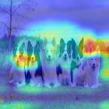       |        |        |        |        |
| vgg19        |        |        |        |        |        |        |
| resnet50     |     |     |     |     |     |     |
| resnet101    |    |    |    |     |    |    |
| densenet121  |  |  |  |  |  |  |
| inception_v3 |    |    |    |    |    |    |
| mobilenet_v2 |    |    |    |    |    |    |
| shufflenet_v2 |    |    |    |    |    |    |

 

## 总结

- vgg模型的Grad-CAM并没有覆盖整个对象,相对来说resnet和denset覆盖更全,特别是densenet;从侧面说明就模型的泛化和鲁棒性而言densenet>resnet>vgg
- Grad-CAM++相对于Grad-CAM也是覆盖对象更全面，特别是对于同一个类别有多个实例的情况下,Grad-CAM可能只覆盖部分对象，Grad-CAM++基本覆盖所有对象;但是这仅仅对于vgg而言,想densenet直接使用Grad-CAM也基本能够覆盖所有对象
- MobileNet V2的Grad-CAM覆盖也很全面
- Inception V3和MobileNet V2的Guided backpropagation图轮廓很模糊，但是ShuffleNet V2的轮廓则比较清晰


## 目标检测-faster-r-cnn

​        有位网友[SHAOSIHAN](<https://github.com/SHAOSIHAN>)问道怎样在目标检测中使用Grad-CAM;在Grad-CAM和Grad-CAM++论文中都没有提及对目标检测生成CAM图。我想主要有两个原因：

a) 目标检测不同于分类，分类网络只有一个分类损失，而且所有网络都是一样的(几个类别最后一层就是几个神经元)，最后的预测输出都是单一的类别得分分布。目标检测则不同，输出都不是单一的，而且不同的网络如Faster R-CNN, CornerNet,CenterNet,FCOS，它们的建模方式不一样，输出的含义都不相同。所以不会有统一的生成Grad-CAM图的方法。

b) 分类属于弱监督，通过CAM可以了解网络预测时主要关注的空间位置，也就是"看哪里"，对分析问题有实际的价值；而目标检测，本身是强监督，预测边框就直接指示了“看哪里”。

​         

​        这里以detetron2中的faster-rcnn网络为例，生成Grad-CAM图。主要思路是直接获取预测分值最高的边框;将该边框的预测分值反向传播梯度到，该边框对应的proposal 边框的feature map上，生成此feature map的CAM图。


### detectron2安装

a) 下载

```shell
git clone https://github.com/facebookresearch/detectron2.git
```


b) 修改`detectron2/modeling/roi_heads/fast_rcnn.py`文件中的`fast_rcnn_inference_single_image`函数，主要是增加索引号，记录分值高的预测边框是由第几个proposal边框生成的；修改后的`fast_rcnn_inference_single_image`函数如下：

```python
def fast_rcnn_inference_single_image(
        boxes, scores, image_shape, score_thresh, nms_thresh, topk_per_image
):
    """
    Single-image inference. Return bounding-box detection results by thresholding
    on scores and applying non-maximum suppression (NMS).

    Args:
        Same as `fast_rcnn_inference`, but with boxes, scores, and image shapes
        per image.

    Returns:
        Same as `fast_rcnn_inference`, but for only one image.
    """
    valid_mask = torch.isfinite(boxes).all(dim=1) & torch.isfinite(scores).all(dim=1)
    indices = torch.arange(start=0, end=scores.shape[0], dtype=int)
    indices = indices.expand((scores.shape[1], scores.shape[0])).T
    if not valid_mask.all():
        boxes = boxes[valid_mask]
        scores = scores[valid_mask]
        indices = indices[valid_mask]
    scores = scores[:, :-1]
    indices = indices[:, :-1]

    num_bbox_reg_classes = boxes.shape[1] // 4
    # Convert to Boxes to use the `clip` function ...
    boxes = Boxes(boxes.reshape(-1, 4))
    boxes.clip(image_shape)
    boxes = boxes.tensor.view(-1, num_bbox_reg_classes, 4)  # R x C x 4

    # Filter results based on detection scores
    filter_mask = scores > score_thresh  # R x K
    # R' x 2. First column contains indices of the R predictions;
    # Second column contains indices of classes.
    filter_inds = filter_mask.nonzero()
    if num_bbox_reg_classes == 1:
        boxes = boxes[filter_inds[:, 0], 0]
    else:
        boxes = boxes[filter_mask]

    scores = scores[filter_mask]
    indices = indices[filter_mask]
    # Apply per-class NMS
    keep = batched_nms(boxes, scores, filter_inds[:, 1], nms_thresh)
    if topk_per_image >= 0:
        keep = keep[:topk_per_image]
    boxes, scores, filter_inds = boxes[keep], scores[keep], filter_inds[keep]
    indices = indices[keep]

    result = Instances(image_shape)
    result.pred_boxes = Boxes(boxes)
    result.scores = scores
    result.pred_classes = filter_inds[:, 1]
    result.indices = indices
    return result, filter_inds[:, 0]
```


c) 安装;如遇到问题，请参考[detectron2](https://github.com/facebookresearch/detectron2)；不同操作系统安装有差异

```shell
cd detectron2
pip install -e .
```


### 测试

a) 预训练模型下载

```shell
wget https://dl.fbaipublicfiles.com/detectron2/PascalVOC-Detection/faster_rcnn_R_50_C4/142202221/model_final_b1acc2.pkl
```


b) 测试Grad-CAM图像生成

​          在本工程目录下执行如下命令

```shell
export KMP_DUPLICATE_LIB_OK=TRUE
python detection/demo.py --config-file detection/faster_rcnn_R_50_C4.yaml \
--input ./examples/pic1.jpg \
--opts MODEL.WEIGHTS /Users/yizuotian/pretrained_model/model_final_b1acc2.pkl MODEL.DEVICE cpu
```


### Grad-CAM结果

| 原始图像                 | 检测边框                                  | Grad-CAM HeatMap                      | Grad-CAM++ HeatMap                      | 边框预测类别 |
| ------------------------ | ----------------------------------------- | ------------------------------------- | --------------------------------------- | ------------ |
|  |  |  |  | Dog          |
|  |  |  |  | Aeroplane    |
|  |  |  |  | Person       |
|  |  |  |  | Horse        |


### 总结

​          对于目标检测Grad-CAM++的效果并没有比Grad-CAM效果好，推测目标检测中预测边框已经是单个对象了,Grad-CAM++在多个对象的情况下优于Grad-CAM


## 目标检测-retinanet

​        在目标检测网络faster r-cnn的Grad-CAM完成后，有两位网友[**abhigoku10**](<https://github.com/abhigoku10>) 、[**wangzyon**](<https://github.com/wangzyon>)问道怎样在retinanet中实现Grad-CAM。retinanet与faster  r-cnn网络结构不同，CAM的生成也有一些差异；以下是详细的过程：

### detectron2安装

a) 下载

```shell
git clone https://github.com/facebookresearch/detectron2.git
```


b) 修改`detectron2/modeling/meta_arch/retinanet.py` 文件中的`inference_single_image`函数，主要是增加feature level 索引，记录分值高的预测边框是由第几层feature map生成的；修改后的`inference_single_image`函数如下：

```python
    def inference_single_image(self, box_cls, box_delta, anchors, image_size):
        """
        Single-image inference. Return bounding-box detection results by thresholding
        on scores and applying non-maximum suppression (NMS).

        Arguments:
            box_cls (list[Tensor]): list of #feature levels. Each entry contains
                tensor of size (H x W x A, K)
            box_delta (list[Tensor]): Same shape as 'box_cls' except that K becomes 4.
            anchors (list[Boxes]): list of #feature levels. Each entry contains
                a Boxes object, which contains all the anchors for that
                image in that feature level.
            image_size (tuple(H, W)): a tuple of the image height and width.

        Returns:
            Same as `inference`, but for only one image.
        """
        boxes_all = []
        scores_all = []
        class_idxs_all = []
        feature_level_all = []

        # Iterate over every feature level
        for i, (box_cls_i, box_reg_i, anchors_i) in enumerate(zip(box_cls, box_delta, anchors)):
            # (HxWxAxK,)
            box_cls_i = box_cls_i.flatten().sigmoid_()

            # Keep top k top scoring indices only.
            num_topk = min(self.topk_candidates, box_reg_i.size(0))
            # torch.sort is actually faster than .topk (at least on GPUs)
            predicted_prob, topk_idxs = box_cls_i.sort(descending=True)
            predicted_prob = predicted_prob[:num_topk]
            topk_idxs = topk_idxs[:num_topk]

            # filter out the proposals with low confidence score
            keep_idxs = predicted_prob > self.score_threshold
            predicted_prob = predicted_prob[keep_idxs]
            topk_idxs = topk_idxs[keep_idxs]

            anchor_idxs = topk_idxs // self.num_classes
            classes_idxs = topk_idxs % self.num_classes

            box_reg_i = box_reg_i[anchor_idxs]
            anchors_i = anchors_i[anchor_idxs]
            # predict boxes
            predicted_boxes = self.box2box_transform.apply_deltas(box_reg_i, anchors_i.tensor)

            boxes_all.append(predicted_boxes)
            scores_all.append(predicted_prob)
            class_idxs_all.append(classes_idxs)
            feature_level_all.append(torch.ones_like(classes_idxs) * i)

        boxes_all, scores_all, class_idxs_all, feature_level_all = [
            cat(x) for x in [boxes_all, scores_all, class_idxs_all, feature_level_all]
        ]
        keep = batched_nms(boxes_all, scores_all, class_idxs_all, self.nms_threshold)
        keep = keep[: self.max_detections_per_image]

        result = Instances(image_size)
        result.pred_boxes = Boxes(boxes_all[keep])
        result.scores = scores_all[keep]
        result.pred_classes = class_idxs_all[keep]
        result.feature_levels = feature_level_all[keep]
        return result
```

c) 修改`detectron2/modeling/meta_arch/retinanet.py` 文件增加`predict`函数，具体如下：

```python
    def predict(self, batched_inputs):
        """
        Args:
            batched_inputs: a list, batched outputs of :class:`DatasetMapper` .
                Each item in the list contains the inputs for one image.
                For now, each item in the list is a dict that contains:

                * image: Tensor, image in (C, H, W) format.
                * instances: Instances

                Other information that's included in the original dicts, such as:

                * "height", "width" (int): the output resolution of the model, used in inference.
                  See :meth:`postprocess` for details.
        Returns:
            dict[str: Tensor]:
                mapping from a named loss to a tensor storing the loss. Used during training only.
        """
        images = self.preprocess_image(batched_inputs)

        features = self.backbone(images.tensor)
        features = [features[f] for f in self.in_features]
        box_cls, box_delta = self.head(features)
        anchors = self.anchor_generator(features)

        results = self.inference(box_cls, box_delta, anchors, images.image_sizes)
        processed_results = []
        for results_per_image, input_per_image, image_size in zip(
                results, batched_inputs, images.image_sizes
        ):
            height = input_per_image.get("height", image_size[0])
            width = input_per_image.get("width", image_size[1])
            r = detector_postprocess(results_per_image, height, width)
            processed_results.append({"instances": r})
        return processed_results
```


d) 安装;如遇到问题，请参考[detectron2](https://github.com/facebookresearch/detectron2)；不同操作系统安装有差异

```shell
cd detectron2
pip install -e .
```


### 测试

a) 预训练模型下载

```shell
wget https://dl.fbaipublicfiles.com/detectron2/COCO-Detection/retinanet_R_50_FPN_3x/137849486/model_final_4cafe0.pkl
```


b) 测试Grad-CAM图像生成

​          在本工程目录下执行如下命令:

```shell
export KMP_DUPLICATE_LIB_OK=TRUE
python detection/demo_retinanet.py --config-file detection/retinanet_R_50_FPN_3x.yaml \
      --input ./examples/pic1.jpg \
      --layer-name head.cls_subnet.0 \
      --opts MODEL.WEIGHTS /Users/yizuotian/pretrained_model/model_final_4cafe0.pkl MODEL.DEVICE cpu
```


### Grad-CAM结果

|                        | 图像1                                                        | 图像2                                                        | 图像3                                                        | 图像4                                                        |
| ---------------------- | ------------------------------------------------------------ | ------------------------------------------------------------ | ------------------------------------------------------------ | ------------------------------------------------------------ |
| 原图                   |                                      |                                      |                                      |                                      |
| 预测边框               |                 |                 |                 |                 |
| GradCAM-cls_subnet.0   |   |   |   |   |
| GradCAM-cls_subnet.1   |   |   |   |   |
| GradCAM-cls_subnet.2   |   |   |   |   |
| GradCAM-cls_subnet.3   |   |   |   |   |
| GradCAM-cls_subnet.4   |   |   |   |   |
| GradCAM-cls_subnet.5   |   |   |   |   |
| GradCAM-cls_subnet.6   |   |   |   |   |
| GradCAM-cls_subnet.7   |   |   |   |   |
| GradCAM++-cls_subnet.0 |  |  |  |  |
| GradCAM++-cls_subnet.1 |  |  |  |  |
| GradCAM++-cls_subnet.2 |  |  |  |  |
| GradCAM++-cls_subnet.3 |  |  |  |  |
| GradCAM++-cls_subnet.4 |  |  |  |  |
| GradCAM++-cls_subnet.5 |  |  |  |  |
| GradCAM++-cls_subnet.6 |  |  |  |  |
| GradCAM++-cls_subnet.7 |  |  |  |  |

​            

注：以上分别对head.cls_subnet.0~head.cls_subnet.7共8个层生成Grad-CAM图，这8层分别对应retinanet分类子网络的4层卷积feature map及ReLu激活后的feature map


### 总结

a) retinanet的Grad-CAM图效果都不算好，相对来说中间层head.cls_subnet.2~head.cls_subnet.4相对好一点

b) 个人认为retinanet效果不要的原因是，retinanet最后的分类是卷积层，卷积核实3\*3，也就是说反向传播到最后一个卷积层的feature map上，只有3\*3个单元有梯度。而分类网络或者faster r-cnn分类都是全连接层，感受全局信息，最后一个卷积层的feature map上所有单元都有梯度。

c) 反向传播到浅层的feature map上，有梯度的单元会逐渐增加，但是就像Grad-CAM论文中说的，越浅层的feature map语义信息越弱，所以可以看到head.cls_subnet.0的CAM图效果很差。


## 目标检测-fcos

​        在目标检测网络faster r-cnn和retinanet的Grad-CAM完成后，有位网友[**linsy-ai**](<https://github.com/linsy-ai>) 问道怎样在fcos中实现Grad-CAM。fcos与retinanet基本类似，因为它们整体网络结构类似；这里使用[AdelaiDet](https://github.com/aim-uofa/AdelaiDet) 工程中的fcos网络，以下是详细的过程：

### AdelaiDet安装

a) 下载

```shell
git clone https://github.com/aim-uofa/AdelaiDet.git
```

b) 安装

```shell
cd AdelaiDet
python setup.py build develop
```

 注意：1. AdelaiDet安装依赖[detectron2](https://github.com/facebookresearch/detectron2.git),需要首先安装$\color{red}{detectron2}$

​            2. fcos的不支持CPU,只支持GPU,请确保在$\color{red}{GPU环境}$下安装和测试


### 测试

a) 预训练模型下载

```shell
wget https://cloudstor.aarnet.edu.au/plus/s/glqFc13cCoEyHYy/download -O fcos_R_50_1x.pth
```


b) 测试Grad-CAM图像生成

​          在本工程目录下执行如下命令:

```shell
export CUDA_DEVICE_ORDER="PCI_BUS_ID"
export CUDA_VISIBLE_DEVICES="0"
python AdelaiDet/demo_fcos.py --config-file AdelaiDet/R_50_1x.yaml \
  --input ./examples/pic1.jpg \
  --layer-name proposal_generator.fcos_head.cls_tower.8 \
  --opts MODEL.WEIGHTS /path/to/fcos_R_50_1x.pth MODEL.DEVICE cuda
```


### Grad-CAM结果

|                        | 图像1                                                        | 图像2                                                        | 图像3                                                        | 图像4                                                        |
| ---------------------- | ------------------------------------------------------------ | ------------------------------------------------------------ | ------------------------------------------------------------ | ------------------------------------------------------------ |
| 原图                   |                                      |                                      |                                      |                                      |
| 预测边框               |                 |                 |                 |                 |
| GradCAM-cls_tower.0   |   |   |   |   |
| GradCAM-cls_tower.1   |   |   |   |   |
| GradCAM-cls_tower.2   |   |   |   |   |
| GradCAM-cls_tower.3   |   |   |   |   |
| GradCAM-cls_tower.4   |   |   |   |   |
| GradCAM-cls_tower.5   |   |   |   |   |
| GradCAM-cls_tower.6   |   |   |   |   |
| GradCAM-cls_tower.7   |   |   |   |   |
| GradCAM-cls_tower.8   |   |   |   |   |
| GradCAM-cls_tower.9   |   |   |   |   |
| GradCAM-cls_tower.10   |   |   |   |   |
| GradCAM-cls_tower.11   |   |   |   |   |
| GradCAM++-cls_tower.0 |  |  |  |  |
| GradCAM++-cls_tower.1 |  |  |  |  |
| GradCAM++-cls_tower.2 |  |  |  |  |
| GradCAM++-cls_tower.3 |  |  |  |  |
| GradCAM++-cls_tower.4 |  |  |  |  |
| GradCAM++-cls_tower.5 |  |  |  |  |
| GradCAM++-cls_tower.6 |  |  |  |  |
| GradCAM++-cls_tower.7 |  |  |  |  |
| GradCAM++-cls_tower.8 |  |  |  |  |
| GradCAM++-cls_tower.9 |  |  |  |  |
| GradCAM++-cls_tower.10 |  |  |  |  |
| GradCAM++-cls_tower.11 |  |  |  |  |


注：以上分别对proposal_generator.fcos_head.cls_tower..0~head.cls_subnet.11共12个层生成Grad-CAM图，这12层分别对应fcos分类子网络的4层卷积feature map、组标准化后的feature map及ReLu激活后的feature map


### 总结

​        不总结了，看图效果吧！ 